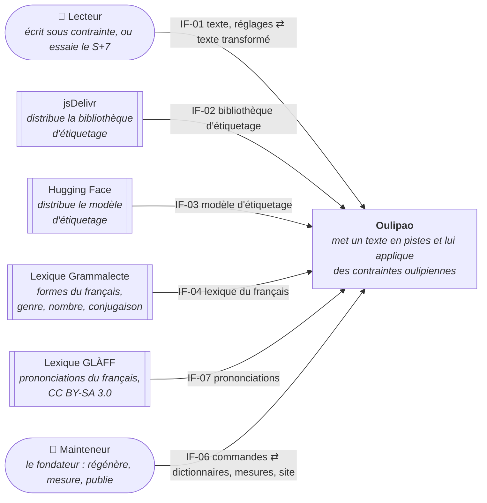

# 3. Contexte et périmètre

**Niveau de détail :** ESSENTIAL, avec un contexte technique : les interfaces passent par des
canaux différents (une page web, deux téléchargements en HTTPS, un fichier local, une ligne de
commande).

## 3.1 Contexte métier

Oulipao reçoit un texte du lecteur et lui rend ce texte transformé par des contraintes
oulipiennes, sans jamais le transmettre à personne. Pour cela, il va chercher à l'extérieur deux
choses qu'il ne produit pas : le moteur et les connaissances de l'étiqueteur neuronal. Le
mainteneur, de son côté, l'alimente en dictionnaires tirés du lexique Grammalecte.

### Diagramme de contexte

Les flèches partent de celui qui prend l'initiative de l'échange. Le lexique Grammalecte est une
source de données : c'est le mainteneur qui l'apporte (section 3.2).

### Interfaces externes

| ID | Partenaire | Ce qui entre dans Oulipao | Ce qui sort d'Oulipao |
|----|------------|---------------------------|-----------------------|
| IF-01 | Lecteur | Un texte français ; les gestes sur la table (contraintes, réglages, pistes muettes ou en solo, pas bouchés) ; l'accord pour charger le modèle, donné par le premier clic | Le texte en pistes ; le texte transformé ; pour chaque mot, ce que chaque contrainte en a fait ; le texte copié avec la mention de la chaîne |
| IF-02 | jsDelivr | La bibliothèque qui fait tourner le modèle d'étiquetage | Rien : ni le texte, ni donnée sur le lecteur, au-delà de la demande de fichier |
| IF-03 | Hugging Face | Le modèle d'étiquetage (tokeniseur et poids) | Rien : ni le texte, ni donnée sur le lecteur, au-delà de la demande de fichier |
| IF-04 | Lexique Grammalecte | Les formes du français avec leur catégorie, leur genre, leur nombre, leur conjugaison et l'interdiction d'élision | Rien |
| IF-06 | Mainteneur | Les commandes : régénérer les dictionnaires, construire les textes de référence, mesurer, vérifier la palette, assembler le site | Les dictionnaires dérivés ; les mesures des étiqueteurs ; les grilles de relecture du S+7 ; le site prêt à publier |
| IF-07 | Lexique GLÀFF | Les prononciations des formes du français, en API, tirées du Wiktionnaire | Rien |

IF-05 (les fichiers dérivés `data/*.tsv`) n'apparaît pas ici : c'est une interface interne
entre deux briques d'Oulipao (section 5).

### Détail des interfaces

#### IF-01 : la page web du lecteur
**Partenaire :** le lecteur. C'est le fondateur avant tout, puis le visiteur qui a lu Queneau ou
Perec (section 1.3).
**But :** écrire sous contrainte en réglant les contraintes en direct.
**Entrée :** un texte collé, ou le texte d'exemple, puis des gestes sur la table.
**Sortie :** le texte transformé et ce qui l'explique : les pistes, l'inspecteur de chaque mot, et
la mention de la chaîne dans le texte copié.
**Garantie :** le texte ne quitte pas la page (objectif 1 de la section 1.2).

#### IF-02 : la bibliothèque d'étiquetage
**Partenaire :** jsDelivr, qui redistribue Transformers.js.
**But :** faire tourner le modèle neuronal dans le navigateur, sans serveur.
**Entrée :** la bibliothèque, dans une version fixée.
**Sortie :** aucune donnée propre au lecteur.

#### IF-03 : le modèle d'étiquetage
**Partenaire :** Hugging Face, qui héberge `Xenova/french-camembert-postag-model`.
**But :** fournir l'étiqueteur qui tient le seuil de l'objectif 2 (96,5 % des mots bien classés).
**Entrée :** le modèle, téléchargé une fois puis gardé par le navigateur. Sa licence n'est pas
déclarée.
**Sortie :** aucune donnée propre au lecteur.

#### IF-04 : le lexique du français
**Partenaire :** le lexique Grammalecte v7.7 (MPL 2.0).
**But :** donner aux contraintes les mots entre lesquels elles choisissent, et de quoi les
accorder. Changer de lexique revient à changer de textbank.
**Entrée :** le lexique complet, environ 700 Mo.
**Sortie :** rien. Les dictionnaires qui en sont dérivés restent sous MPL 2.0 et portent leur
notice.

#### IF-07 : les prononciations du français
**Partenaire :** le lexique GLÀFF 1.2.2 (CLLE-ERSS, dérivé du Wiktionnaire, CC BY-SA 3.0).
**But :** donner aux filtres de rime ce que chaque forme fait entendre : ses syllabes et sa rime
(ADR-007).
**Entrée :** le lexique complet, téléchargé à la main.
**Sortie :** rien. Le fichier qui en est dérivé reste sous CC BY-SA 3.0, séparé du code et des
fichiers tirés de Grammalecte.

#### IF-06 : les commandes du mainteneur
**Partenaire :** le mainteneur, c'est-à-dire le fondateur (section 1.3).
**But :** tenir à jour ce que le site ne calcule pas lui-même : les dictionnaires, les mesures,
le site assemblé.
**Entrée :** une commande `npm run …`.
**Sortie :** des fichiers dans le dépôt (`data/`, `reference/`, `resultats/`) ou dans `_site/`.

### Hors du périmètre

- **Aucun serveur, compte ni stockage.** Oulipao ne garde aucun texte : le refermer, c'est tout
  perdre, sauf ce qu'on a copié.
- **Aucune génération par IA.** Le modèle neuronal sert seulement à classer les mots ; il n'écrit
  rien. Chaque mot nouveau vient d'une règle énoncée, appliquée à un dictionnaire.
- **Aucun partage intégré.** Le résultat sort par le presse-papiers ; il n'y a ni lien de partage
  ni image.
- **Aucun format de plugin public.** L'auteur de plugins de la section 1.3 n'a pas encore
  d'interface : le contrat de plugin reste interne (I-05, section 5).
- **L'hébergement et la publication** (GitHub Pages, GitHub Actions, DNS) sont l'infrastructure
  d'Oulipao, pas des partenaires. Ils sont décrits dans la section 7. Le lien « Code source » vers
  le dépôt GitHub est un simple lien, pas une interface.
- **Les agents de code** de la section 1.3 travaillent sur le dépôt, pas avec le système en
  marche.

---

## 3.2 Contexte technique

Toutes les interfaces avec le lecteur et les deux distributeurs passent par le navigateur, en
HTTPS. Les interfaces du mainteneur passent par Node, sur son poste. Aucune n'exige
d'authentification : tout ce qu'Oulipao télécharge est public, et il n'envoie rien qui
mériterait d'être protégé.

| ID | Technologie | Protocole | Format | Adresse | Authentification |
|----|-------------|-----------|--------|---------|------------------|
| IF-01 | Navigateur : HTML, DOM, Preact | HTTPS pour charger la page ; ensuite, tout est local | Texte saisi ; presse-papiers (`navigator.clipboard`) | `https://oulipao.incongru.org/` (page à pistes), `/essai.html` (page d'essai) | Aucune |
| IF-02 | `import()` dynamique d'un module ES | HTTPS | JavaScript (ESM) et WebAssembly | `https://cdn.jsdelivr.net/npm/@huggingface/transformers@4.3.0` | Aucune ; pas de vérification d'intégrité (SRI) |
| IF-03 | Transformers.js `from_pretrained` | HTTPS, avec une redirection 302 vers le CDN de Hugging Face | ONNX quantifié q8, JSON du tokeniseur | `https://huggingface.co/Xenova/french-camembert-postag-model`, redirigé vers `*.hf.co` | Aucune |
| IF-04 | Fichier local, lu par `scripts/build-*.ts` | Aucun (téléchargé à la main) | Texte tabulé, une forme par ligne | `data/brut/lexique-grammalecte-fr-v7.7.txt`, tiré de `https://grammalecte.net/dic/` (voir `docs/lexiques.md`) | Aucune |
| IF-06 | Node, scripts `scripts/*.ts` | Ligne de commande | `npm run <commande>` ; sorties TSV, JSON, Markdown, HTML | Poste du mainteneur ; `build:site` aussi dans GitHub Actions | Aucune (accès au dépôt) |
| IF-07 | Fichier local, lu par `scripts/build-phonetics.ts` | Aucun (téléchargé à la main) | Texte, champs séparés par `\|` : forme, étiquette GRACE, lemme, prononciations en API et en SAMPA, fréquences | `data/brut/`, tiré de `http://redac.univ-tlse2.fr/lexiques/glaff.html` (voir `docs/lexiques.md`) | Aucune |
