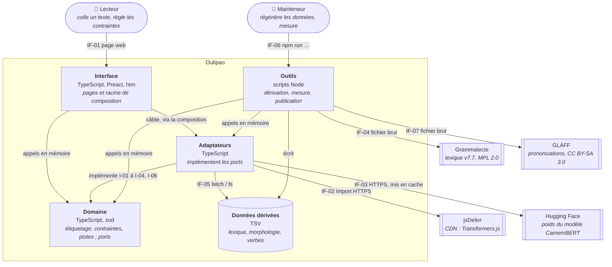

# 5. Vue des briques

**Niveau de détail :** ESSENTIAL (niveau 1, et une boîte noire par brique).

## Vue d'ensemble

Oulipao suit une architecture hexagonale. Le domaine (`src/domain`) est pur : il ne connaît ni
le DOM, ni le réseau, ni le système de fichiers, et il déclare ses besoins sous forme de ports
(`src/ports`). Les adaptateurs (`src/adapters`) branchent ces ports sur le monde réel : le modèle
neuronal, les fichiers de données dérivées, `fetch` ou `node:fs`. L'interface (`src/ui`) monte
les pages et choisit, dans sa racine de composition, quel adaptateur sert quel port.

Ce découpage répond aux contraintes posées dans `CLAUDE.md` : un domaine testé avec des ports
factices (couverture supérieure à 90 %), et des données qui ne passent la frontière que par un
adaptateur, où un schéma zod les valide. Il sert aussi la promesse de confidentialité : tout le
traitement a lieu dans le navigateur, et le texte de l'utilisateur ne quitte jamais la machine.
Le découpage sert directement trois objectifs de la section 1.2. Il sert l'objectif 1 (`#secure`),
puisque aucune brique ne tourne sur un serveur. Il sert l'objectif 2 (`#suitable`), puisque le
Domaine vérifie le contrat de tout étiqueteur. Il sert l'objectif 4 (`#flexible`) : une contrainte
vit dans le Domaine, derrière le contrat de plugin. Trois contraintes ont été ajoutées ainsi sans
toucher aux ports ni aux adaptateurs (voir la section 1.2). La section 4 résume la stratégie
dont découle ce découpage.

---

## 5.1 Le système en boîte blanche

### Diagramme de structure

Les flèches vont de la brique qui dépend vers celle dont elle dépend. Ce niveau ne contient aucun
cycle : les ports appartiennent à la brique Domaine (voir la boîte noire du Domaine).

### Briques contenues

| Nom | Responsabilité | Interfaces |
|-----|----------------|------------|
| Interface | Monte les pages dans le navigateur et câble les adaptateurs sur les ports. | IF-01 (fournie) ; I-01 à I-06 (requises) |
| Domaine | Découpe, étiquette et transforme un texte selon une chaîne de contraintes, sans effet de bord. | I-01 à I-06 (fournies) |
| Adaptateurs | Implémentent les ports à partir du modèle neuronal, des fichiers dérivés, de `fetch` et de `node:fs`. | I-01 à I-04, I-06 (implémentées) ; IF-02, IF-03, IF-05 (requises) |
| Données dérivées | Contiennent les dictionnaires des contraintes, tirés de Grammalecte et, pour les prononciations, de GLÀFF, servis tels quels avec le site. | IF-05 (fournie) |
| Outils | Dérivent les données, mesurent les étiqueteurs, vérifient la palette et assemblent le site publié. | IF-06 (fournie) ; IF-04, IF-07 (requises) |

### Interfaces

| ID | Interface | Nature | Technologie |
|----|-----------|--------|-------------|
| IF-01 | Page web du lecteur : saisie, réglages, résultat, copie | Externe | HTML, DOM, clavier, presse-papiers |
| IF-02 | Bibliothèque Transformers.js 4.3.0 | Externe | `import` dynamique HTTPS depuis jsDelivr |
| IF-03 | Poids du modèle `Xenova/french-camembert-postag-model` (environ 111 Mo, quantifiés) | Externe | HTTPS depuis Hugging Face, mis en cache par le navigateur |
| IF-04 | Lexique Grammalecte v7.7 | Externe | Fichier texte téléchargé à la main dans `data/brut/` (voir `docs/lexiques.md`) |
| IF-06 | Commandes du mainteneur | Externe | Ligne de commande `npm run …`, scripts Node |
| IF-07 | Lexique GLÀFF 1.2.2 (prononciations) | Externe | Fichier texte téléchargé à la main dans `data/brut/` (voir `docs/lexiques.md`) |
| IF-05 | Fichiers dérivés `data/*.tsv` | Interne | `fetch` (navigateur) ou `node:fs` (scripts, tests) ; une version dans l'adresse contourne le cache |
| I-01 | Port `Tagger` : un mot étiqueté par mot du découpage | Interne | Interface TypeScript, `src/ports/tagger.ts` |
| I-02 | Port `MorphologyRepository` : noms, adjectifs, adverbes, élision | Interne | Interface TypeScript, `src/ports/morphology.ts` |
| I-03 | Port `VerbRepository` : infinitifs et formes conjuguées | Interne | Interface TypeScript, `src/ports/verbs.ts` |
| I-04 | Port `TextSource` : le contenu d'un fichier texte | Interne | Type fonction, `src/ports/text-source.ts` |
| I-06 | Port `PhoneticsRepository` : prononciations d'une forme, homophones, formes d'une rime, formes d'une finale | Interne | Interface TypeScript, `src/ports/phonetics.ts` |
| I-05 | Contrat de plugin : réglages, pistes visées, application | Interne | Schémas zod, `src/domain/plugin.ts` et `plugin-chain.ts` |

Les interfaces externes IF-01 à IF-04, IF-06 et IF-07 sont celles du contexte (section 3), avec les
mêmes identifiants. IF-05 est interne et n'y figure pas.

### Justification du découpage

Le découpage reprend la règle hexagonale du projet : chaque brique correspond à un répertoire de
premier niveau, et le sens des dépendances va toujours de l'extérieur vers le domaine. On peut
ainsi remplacer un étiqueteur ou un dictionnaire sans toucher aux contraintes : changer
d'implémentation de `MorphologyRepository` revient à changer de textbank. Les Outils restent une
brique à part, parce qu'ils tournent sous Node, hors du site publié, et que le lecteur n'en
dépend jamais à l'exécution.

---

## Interface — boîte noire

**Rôle :** donner au lecteur deux pages. La page à pistes (`index.html` publiée, construite
depuis `tracks.html`) est le prototype. La page d'essai (`essai.html`) compare les trois
étiqueteurs et applique un S+7 brut. L'Interface décide aussi, dans sa racine de composition,
quels adaptateurs servent les ports, et elle charge la morphologie et les verbes à la demande
seulement. Elle tient enfin le registre des contraintes installées (`installedPlugins`, dans
`src/ui/tracks/mixer-state.ts`) et les recettes (`recipes.ts`), des contraintes de l'Oulipo
nommées qui se réduisent à des instances de ces types : ajouter une contrainte touche donc
aussi l'Interface.

**Interfaces :**

| ID | Description | Type | Technologie |
|----|-------------|------|-------------|
| IF-01 | Page web du lecteur | Fournie | HTML, DOM, Preact 11, htm |
| I-01 à I-06 | Ports et contrat de plugin du Domaine | Requises | Appels en mémoire |

**Emplacement du code :**
- `src/ui/tracks/` pour la page à pistes : `controller.ts` tient l'état, `view-model.ts` le met en forme, et `components/` contient les composants ;
- `src/ui/page.ts` et `src/ui/render.ts` pour la page d'essai ;
- `src/ui/composition.ts` pour la racine de composition, commune aux deux pages.

**Limites connues :** les points d'entrée (`page.ts`, `tracks/main.ts`) touchent le DOM et sont
exclus de la couverture ; toute la logique testable vit dans le contrôleur, le modèle de vue et
les composants. Les versions des fichiers dérivés (`MORPHOLOGY_VERSION`, `VERBS_VERSION`) se
changent à la main après chaque régénération.

---

## Domaine — boîte noire

**Rôle :** porter toute la logique d'Oulipao sans effet de bord. Le Domaine découpe le texte en
mots, vérifie qu'un étiqueteur respecte le contrat du port, répartit les mots en pistes (noms,
adjectifs, verbes, adverbes, mots-outils), puis applique une chaîne de contraintes (S+n,
lipogramme, tri par piste, bord, mise en vers) en gardant les accords, l'élision et la majuscule initiale. Il calcule aussi la
comparaison avec les textes de référence et la vérification de la palette.

Les ports (`src/ports`) font partie de cette brique : ils forment son interface requise vers
l'extérieur. Ils réutilisent des types du domaine (`TaggedWord`, `NounForm`, `VerbForm`) et le
domaine les importe en retour. Ce va-et-vient reste interne à la brique, ce qui est l'usage
hexagonal ordinaire.

**Interfaces :**

| ID | Description | Type | Technologie |
|----|-------------|------|-------------|
| I-01 | `Tagger` | Fournie (à implémenter) | Interface TypeScript |
| I-02 | `MorphologyRepository` | Fournie (à implémenter) | Interface TypeScript |
| I-03 | `VerbRepository` | Fournie (à implémenter) | Interface TypeScript |
| I-04 | `TextSource` | Fournie (à implémenter) | Type fonction |
| I-06 | `PhoneticsRepository` | Fournie (à implémenter) | Interface TypeScript |
| I-05 | Contrat de plugin et chaîne de plugins | Fournie | Schémas zod |

**Emplacement du code :**
- `src/domain/` : découpage (`tokenizer.ts`), étiquetage (`tagging.ts`), pistes (`mixing.ts`), chaîne (`plugin.ts`, `plugin-chain.ts`) ;
- `src/domain/s7/` : le moteur S+7 et ses accords ;
- `src/domain/lipogram/` : le lipogramme ;
- `src/domain/track-sort/`, `edge/`, `lineation/` : le tri par piste, le bord et la mise en vers,
  avec leurs règles communes de retrait (`removal.ts`) et de lignes (`lines.ts`) ;
- `src/domain/rhyme/` : les filtres de rime (R+n, monorime, antirime, homophonies) ;
- `src/domain/phonetics/` : la rime, les syllabes et la prononciation devinée par règles ;
  `verse.ts` : la découpe en vers et en strophes ; `neighbours.ts` : le n-ième voisin qui passe
  un critère, commun au lipogramme et au R+n ;
- `src/ports/` : les ports.

**Limites connues :** le contrat de plugin est interne, sans version et non publié. Neuf
contraintes l'utilisent ; il ne sera ouvert que si quelqu'un d'autre veut en écrire une (ADR-004). Le découpage en mots suit des règles
minimales, et les mots composés (« peut-être ») restent un seul mot. La seule dépendance de la
brique est zod.

---

## Adaptateurs — boîte noire

**Rôle :** raccorder les ports du Domaine au monde réel, et valider par zod tout ce qui entre.

Le site utilise trois groupes d'adaptateurs :
- **les étiqueteurs** : CamemBERT neuronal, fr-compromise et une recherche dans le lexique dérivé ;
- **la morphologie, les verbes et les prononciations**, tenus en mémoire à partir des fichiers TSV ;
- **une source de texte** fondée sur `fetch`.

Deux autres ne servent qu'aux Outils : la dérivation des lexiques Grammalecte et GLÀFF, et la grille de
relecture en Markdown, plus une source de texte fondée sur `node:fs`.

**Interfaces :**

| ID | Description | Type | Technologie |
|----|-------------|------|-------------|
| I-01 à I-04, I-06 | Ports du Domaine | Implémentées | TypeScript |
| IF-02 | Transformers.js | Requise | `import` HTTPS (navigateur), `@huggingface/transformers` (Node) |
| IF-03 | Poids CamemBERT | Requise | HTTPS, cache du navigateur |
| IF-05 | Fichiers dérivés | Requise | `fetch`, `node:fs` |

**Emplacement du code :**
- `src/adapters/taggers/` : les étiqueteurs ;
- `src/adapters/morphology/` : la morphologie, les verbes et les prononciations en mémoire ;
- `src/adapters/text-sources/` : les sources de texte ;
- `src/adapters/lexicon/` et `src/adapters/reports/` : les adaptateurs propres aux Outils ;
- `vendor/fr-compromise.mjs` : la bibliothèque fr-compromise, embarquée.

**Limites connues :** la bibliothèque et les poids du modèle sont servis par des tiers (jsDelivr,
Hugging Face), et la licence du modèle n'est pas déclarée. Le chargement du modèle
(`camembert-model.ts`) est exclu de la couverture, parce qu'il est trop lourd pour un test
unitaire ; sa logique testable vit dans `camembert-tagger.ts`.

---

## Données dérivées — boîte noire

**Rôle :** fournir aux contraintes et à l'étiqueteur par lexique leurs dictionnaires, dans un
format plat que le navigateur lit sans traitement préalable. Ces fichiers sont produits par les
Outils, suivis dans le dépôt et copiés tels quels dans le site publié. `phonetique-oulipao.tsv`
(12,5 Mo, 1,98 Mo compressé) est tiré de GLÀFF et reste sous CC BY-SA 3.0 ; il n'est chargé que
lorsqu'un filtre phonétique est en marche. Le lexique brut
(`data/brut/`, environ 700 Mo) n'est ni suivi ni publié.

**Interfaces :**

| ID | Description | Type | Technologie |
|----|-------------|------|-------------|
| IF-05 | `lexique-oulipao.tsv`, `morpho-oulipao.tsv`, `verbes-oulipao.tsv`, `phonetique-oulipao.tsv` | Fournie | TSV, servi en statique |

**Emplacement :** `data/`. Les formats sont décrits en tête de
`src/adapters/morphology/in-memory-morphology.ts`, `in-memory-verbs.ts` et `in-memory-phonetics.ts`.

**Limites connues :** l'adresse versionnée dépend d'une constante qu'on met à jour à la main ; si
on l'oublie, un navigateur peut garder l'ancienne copie en cache.

---

## Outils — boîte noire

**Rôle :** tout ce qui se fait hors du navigateur, à la main, par le mainteneur :
- dériver les fichiers TSV des lexiques Grammalecte et GLÀFF ;
- construire les textes de référence annotés ;
- mesurer les étiqueteurs ;
- produire les grilles de relecture du S+7 ;
- vérifier les contrastes et la distinction des couleurs de la palette ;
- assembler le site publié dans `_site/`.

**Interfaces :**

| ID | Description | Type | Technologie |
|----|-------------|------|-------------|
| IF-06 | Commandes du mainteneur | Fournie | `npm run …` |
| IF-04 | Lexique Grammalecte v7.7 | Requise | Fichier texte local |
| IF-07 | Lexique GLÀFF 1.2.2 | Requise | Fichier texte local |
| IF-05 | Fichiers dérivés | Écrits | TSV |

**Emplacement du code :** `scripts/`, lancés par `npm run build:lexicon`, `build:morphology`,
`build:verbs`, `build:phonetics`, `build:references`, `measure`, `transform:references`, `check:palette` et
`build:site`.

**Limites connues :** seul `build:site` tourne en intégration continue
(`.github/workflows/release.yml`, après `typecheck` et `test`). La régénération des données et la
mise à jour des versions d'adresse restent des étapes manuelles.
