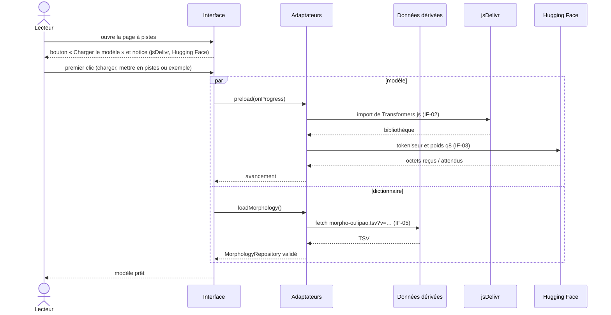
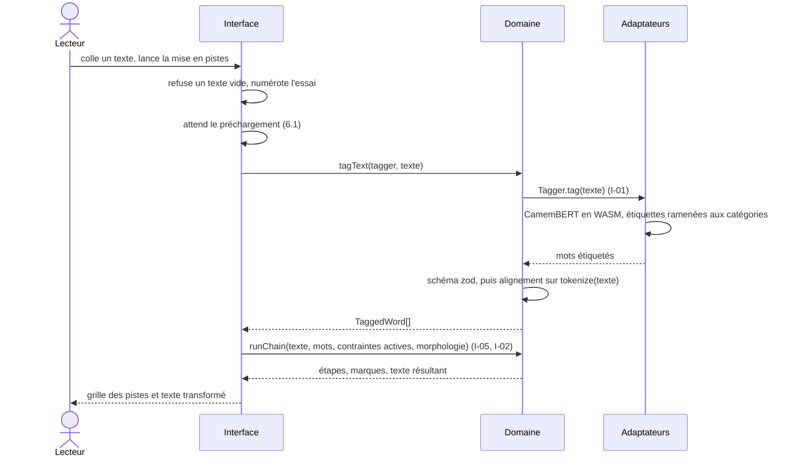
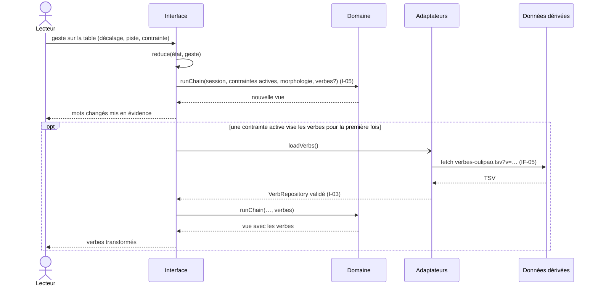
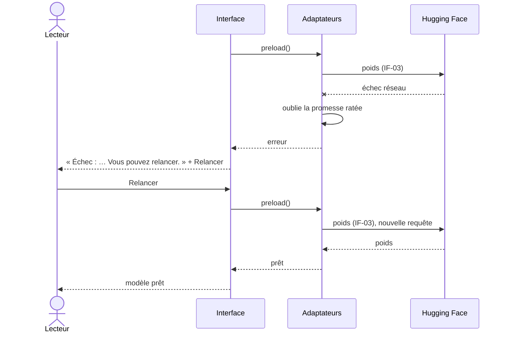

# 6. Vue d'exécution

**Niveau de détail :** ESSENTIAL (étapes numérotées et un diagramme de séquence par scénario).

## Vue d'ensemble

Les quatre scénarios suivent le parcours du lecteur sur la page à pistes :
1. le chargement du modèle au premier clic ;
2. la mise en pistes d'un texte, qui est le chemin nominal ;
3. le réglage en direct d'une contrainte, sans réétiqueter le texte ;
4. la reprise après un échec.

Ensemble, ils montrent trois traits de l'architecture : tout le calcul se fait dans le navigateur,
seuls le modèle et les dictionnaires transitent par le réseau, et l'étiquetage, qui est coûteux,
reste séparé de l'application des contraintes, qui est rapide et rejouée à chaque geste.

Les participants sont les briques de la section 5 et les partenaires externes de la section 3,
avec leurs identifiants IF-xx. Les objectifs de qualité renvoient
à la section 1.2.

---

## 6.1 Ouverture de la page et chargement du modèle au premier clic

**But :** montrer comment le modèle arrive dans le navigateur sans bloquer la page (environ
141 Mo au premier chargement, dont 111 Mo de poids : voir `RESULTATS.md`), et pourquoi rien ne
part vers un tiers avant que le lecteur ait cliqué (section 2.5).

**Déclencheur :** le lecteur ouvre la page à pistes, puis clique sur « Charger le modèle »,
« Mettre en pistes » ou « Essayer avec un exemple ».

**Participants :** Lecteur, Interface, Adaptateurs, Données dérivées, jsDelivr, Hugging Face.

**Objectif de qualité illustré :** objectif 1, `#secure` (le texte reste dans le navigateur) : le texte n'est envoyé
nulle part ; seuls la bibliothèque et les poids sont téléchargés, et seulement après un clic.
Sobriété aussi : qui ouvre la page sans s'en servir ne télécharge rien.

### Séquence

1. L'Interface monte la page et affiche le bouton « Charger le modèle (141 Mo) », avec une notice
   qui nomme jsDelivr et Hugging Face et dit qu'ils verront l'adresse du lecteur. Rien ne part.
2. Au premier clic sur « Charger le modèle », « Mettre en pistes » ou « Essayer avec un exemple »,
   l'Interface lance deux chargements en parallèle. Avec les deux derniers, la mise en pistes
   suit (6.2).
3. Premier chargement : les Adaptateurs importent Transformers.js depuis jsDelivr (IF-02), puis
   téléchargent le tokeniseur et les poids quantifiés depuis Hugging Face (IF-03). L'avancement,
   en octets, remonte jusqu'à une barre de progression.
4. Second chargement : les Adaptateurs lisent `morpho-oulipao.tsv` (IF-05), dont l'adresse porte
   une version, et valident chaque ligne.
5. Quand les deux chargements ont abouti, le modèle passe à l'état « prêt » et la barre disparaît.
   Le navigateur garde les poids en cache pour les visites suivantes.

### Gestion des erreurs

| Étape | Échec | Réponse du système |
|-------|-------|--------------------|
| 3 | jsDelivr ou Hugging Face injoignable, téléchargement interrompu | État « erreur », message et bouton « Relancer ». L'échec n'est pas gardé en mémoire : la relance retélécharge. Voir 6.4. |
| 4 | Fichier absent (statut HTTP non 2xx) ou ligne non conforme | Même état d'erreur ; le chargeur oublie la promesse ratée, et la relance refait la requête. |
| 2 | Le lecteur relance une mise en pistes pendant le chargement | Aucun second téléchargement : la mise en pistes attend la promesse en cours (voir 6.2). |

---

## 6.2 Mettre un texte en pistes (chemin nominal)

**But :** montrer le chemin principal, du texte collé au texte transformé, et la vérification
du contrat de l'étiqueteur par le Domaine.

**Déclencheur :** le lecteur colle un texte puis lance la mise en pistes, ou choisit le texte
d'exemple.

**Participants :** Lecteur, Interface, Domaine, Adaptateurs.

**Objectif de qualité illustré :** objectif 2, `#suitable` (un français correct) : le Domaine refuse
toute sortie d'étiqueteur qui ne correspond pas mot pour mot à son propre découpage.

### Séquence

1. L'Interface refuse un texte vide (« Collez d'abord un texte. ») et numérote cet essai.
2. Elle attend le préchargement : soit il est déjà prêt, soit elle rejoint celui qui est en cours
   (6.1).
3. Elle demande au Domaine d'étiqueter le texte (`tagText`). Le Domaine appelle le port `Tagger`
   (I-01), servi par l'étiqueteur CamemBERT des Adaptateurs.
4. L'adaptateur fait tourner le modèle dans le navigateur (WASM) et ramène les étiquettes du
   French Treebank aux cinq catégories d'Oulipao.
5. Le Domaine valide la sortie avec zod, puis vérifie qu'elle compte autant de mots que son
   propre découpage, dans le même ordre et avec les mêmes formes.
6. L'Interface garde le texte étiqueté comme session. Elle rouvre les pas de la grille, puis
   demande au Domaine d'appliquer la chaîne de contraintes active (`runChain`, I-05), avec la
   morphologie (I-02).
7. Le Domaine rend les mots transformés, étape par étape, avec ce qu'il a fait de chaque mot :
   remplacé, retiré, ou laissé et pourquoi. L'Interface en tire la grille des pistes et le texte
   résultant, puis replie la saisie.

### Gestion des erreurs

| Étape | Échec | Réponse du système |
|-------|-------|--------------------|
| 1 | Texte vide ou blanc | Message sous la saisie, rien n'est lancé. |
| 2 | Le préchargement échoue | La mise en pistes s'arrête sans message propre ; c'est l'état d'erreur du modèle qui s'affiche (6.1). |
| 3–5 | Sortie non conforme, mauvais nombre de mots, mot différent | Le Domaine lève une erreur qui nomme l'étiqueteur et le mot fautif. L'Interface affiche « Échec de l'étiquetage : … Vous pouvez relancer. » |
| 2–5 | Le lecteur relance avant la fin | Le numéro d'essai fait abandonner silencieusement l'essai le plus ancien ; seul le plus récent s'affiche. |

---

## 6.3 Régler une contrainte en direct

**But :** montrer que tourner un réglage (le décalage du S+7, une piste muette ou en solo, une
contrainte ajoutée) rejoue seulement la chaîne de contraintes, sans réétiqueter le texte. C'est
ce qui rend la métaphore de la table de mixage jouable. Le scénario montre aussi le chargement
paresseux des verbes.

**Déclencheur :** un geste du lecteur sur la table : un bouton, un champ numérique ou une piste.

**Participants :** Lecteur, Interface, Domaine, Adaptateurs, Données dérivées.

**Objectif de qualité illustré :** objectif 3, `#efficient` (un réglage en direct) : chaque geste ne coûte qu'un
passage de la chaîne en mémoire. Sobriété aussi : le fichier des verbes n'est téléchargé que
lorsqu'une contrainte active vise la piste des verbes.

### Séquence

1. L'Interface réduit le geste en un nouvel état de la table (`reduce`).
2. Elle rejoue la chaîne sur la session déjà étiquetée (`runChain`, I-05), avec la morphologie et,
   s'ils sont chargés, les verbes.
3. Elle compare la nouvelle vue à l'ancienne et fait ressortir les mots du texte résultant qui ont
   changé.
4. Si une contrainte active vise désormais la piste des verbes et que les verbes ne sont pas
   encore chargés, l'Interface les demande aux Adaptateurs, sans attendre la réponse.
5. Les Adaptateurs lisent `verbes-oulipao.tsv` (IF-05) et valident chaque ligne. Les
   prononciations (`phonetique-oulipao.tsv`) suivent le même chemin, la première fois qu'un filtre
   de rime est en marche (ADR-007). L'Interface
   rejoue alors la chaîne : les verbes transformés apparaissent.

### Gestion des erreurs

| Étape | Échec | Réponse du système |
|-------|-------|--------------------|
| 2 | Aucun texte encore mis en pistes | Le geste met seulement l'état à jour ; la vue sera calculée à la prochaine mise en pistes. |
| 5 | Fichier des verbes introuvable ou non conforme | « Échec du chargement des verbes : … ». Les autres pistes restent transformées. Le chargeur oublie l'échec, et un nouvel essai refait la requête. |

---

## 6.4 Reprise après l'échec du chargement

**But :** montrer que les échecs réseau ne laissent pas la page dans un état bloqué. Chaque
chargeur oublie sa promesse ratée, si bien que « Relancer » repart de zéro au lieu de rejouer
l'erreur gardée en mémoire.

**Déclencheur :** un téléchargement du scénario 6.1 échoue (réseau coupé, CDN indisponible,
fichier absent), puis le lecteur clique sur « Relancer ».

**Participants :** Lecteur, Interface, Adaptateurs, Hugging Face.

**Objectif de qualité illustré :** aucun des objectifs de la section 1.2. C'est le scénario d'erreur obligatoire : la page reste utilisable face au réseau.

### Séquence

1. Pendant le préchargement (6.1), le téléchargement des poids depuis Hugging Face échoue.
2. Les Adaptateurs oublient la promesse de chargement du modèle et transmettent l'erreur.
3. L'Interface passe le modèle à l'état « erreur » et affiche le message, avec un bouton
   « Relancer » dans une zone `role="alert"`.
4. Le lecteur clique sur « Relancer » : l'Interface relance le préchargement. Comme rien n'est
   resté en mémoire, les Adaptateurs refont l'import et le téléchargement. Le navigateur peut
   resservir depuis son cache ce qui était déjà arrivé.
5. En cas de succès, le modèle passe à « prêt » et une mise en pistes en attente peut être
   relancée (6.2).

### Gestion des erreurs

| Étape | Échec | Réponse du système |
|-------|-------|--------------------|
| 4 | La relance échoue à nouveau | Même état d'erreur, et on peut relancer indéfiniment : il n'y a ni nouvelle tentative automatique ni solution de repli. |
| — | Copie du texte résultant refusée par le navigateur | « Copie impossible : … » à côté du bouton ; le texte reste affiché. |
