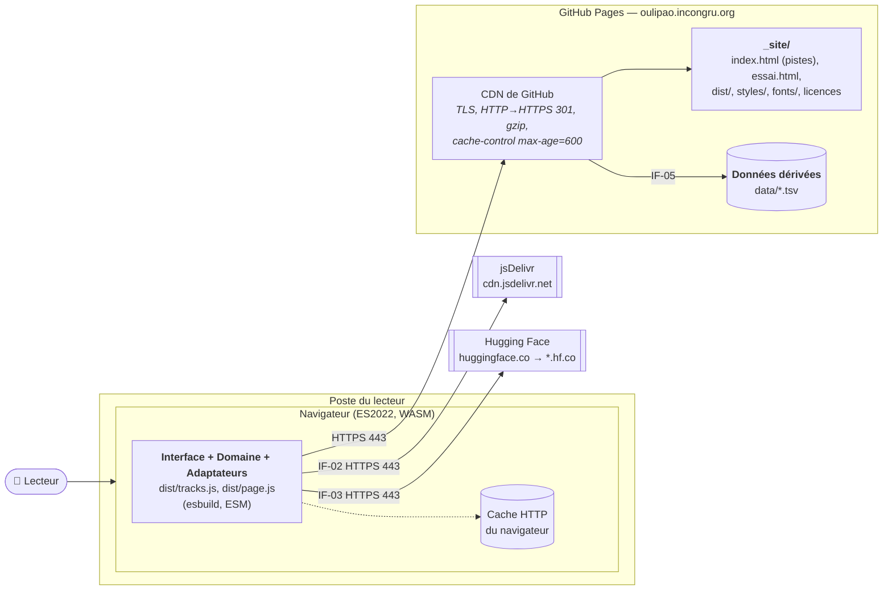

# 7. Vue de déploiement

**Niveau de détail :** ESSENTIAL (tableau des correspondances, tableau des environnements et
diagramme de production).

## Vue d'ensemble

Oulipao n'a pas de serveur applicatif. Le site est un ensemble de fichiers statiques, publié sur
GitHub Pages sous `https://oulipao.incongru.org`. Tout le calcul (étiquetage, contraintes, rendu)
tourne dans le navigateur du lecteur, et le texte collé ne part vers aucune requête. Seuls trois
fournisseurs reçoivent des requêtes : GitHub Pages pour le site et les dictionnaires, jsDelivr pour
Transformers.js, Hugging Face pour les poids du modèle (`huggingface.co`, qui redirige vers
`*.hf.co`) (exigence « Le texte reste dans le
navigateur », `openspec/specs/mise-en-ligne/spec.md`).

Ce choix dispense de dimensionner, de surveiller et de sécuriser une machine : la charge
grandit avec le nombre de lecteurs, mais elle porte sur leurs propres processeurs. Le prix à
payer, c'est que chaque lecteur télécharge le modèle et les dictionnaires, et que la disponibilité
dépend entièrement de trois fournisseurs tiers.

---

## 7.1 Production

### Diagramme de déploiement

### Composants d'infrastructure

| Composant | Type | Rôle | Dimensionnement |
|-----------|------|------|-----------------|
| GitHub Pages | Hébergement statique géré | Sert le site et les fichiers dérivés ; termine TLS | Offre gratuite ; aucun réglage de taille ni de nombre d'instances |
| DNS `incongru.org` | Enregistrement CNAME | `oulipao.incongru.org` → `constructions-incongrues.github.io` | — |
| jsDelivr | CDN public tiers | Sert Transformers.js 4.3.0 | Hors de notre contrôle |
| Hugging Face Hub | Hébergement de modèles, tiers | Sert les poids q8 de `Xenova/french-camembert-postag-model` | Hors de notre contrôle |
| Navigateur du lecteur | Environnement d'exécution | Exécute le code assemblé et le modèle (WASM) | Celui du lecteur ; environ 111 Mo de poids, plus les dictionnaires en mémoire |

### Correspondance entre briques et infrastructure

| Brique (section 5) | Déployée sur | Instances | Remarques |
|--------------------|--------------|-----------|-----------|
| Interface | Navigateur du lecteur, servie par GitHub Pages | Une par onglet ouvert | Assemblée par esbuild en `dist/tracks.js` (page à pistes) et `dist/page.js` (page d'essai), avec carte des sources |
| Domaine | Navigateur du lecteur, dans le même fichier assemblé | Une par onglet ouvert | Aucune dépendance d'exécution hors zod, qui est embarqué |
| Adaptateurs | Navigateur du lecteur, dans le même fichier assemblé | Une par onglet ouvert | Les adaptateurs propres aux Outils (`lexicon/`, `reports/`, `file-text-source`) n'entrent pas dans le fichier publié |
| Données dérivées | GitHub Pages, fichiers statiques `data/` | Un exemplaire | Environ 44 Mo bruts, en quatre fichiers. Compressés en gzip à l'envoi : `verbes-oulipao.tsv` passe de 18,7 Mo à 2,8 Mo transférés, `phonetique-oulipao.tsv` de 12,5 Mo à 1,98 Mo (mesuré le 2026-10-03) |
| Outils | Poste du mainteneur (Node) ; `build:site` aussi dans GitHub Actions | — | Jamais publiés ; le lexique brut (`data/brut/`, environ 700 Mo) reste sur le poste du mainteneur |

### Réseau et sécurité

- **Ce qui est public :** tout le site. Il n'existe ni réseau privé, ni secret côté client, ni
  point d'entrée qui accepte des données.
- **Terminaison TLS :** sur le CDN de GitHub Pages. Le certificat du domaine personnalisé est
  émis et renouvelé par GitHub. Une requête en `http://` reçoit une redirection 301 vers HTTPS.
- **Hôtes tiers :** jsDelivr et Hugging Face, appelés en HTTPS depuis le navigateur. Le code
  importé de jsDelivr est épinglé à la version 4.3.0, mais sans vérification d'intégrité (SRI).
- **Politique de sécurité du contenu (CSP) :** déclarée dans une balise `<meta>` de chaque page,
  puisque GitHub Pages n'envoie pas d'en-têtes personnalisés. `connect-src` n'admet que le site, `cdn.jsdelivr.net`, `huggingface.co` et `*.hf.co` : aucune
  requête ne peut partir ailleurs, même lancée par un code tiers altéré. `frame-ancestors`, qu'une
  balise `<meta>` ne peut pas porter, manque.
- **Mesure d'audience :** aucune, ni traceur.

### Réplication et mise à l'échelle

Il n'y a rien à configurer : GitHub Pages sert le site depuis son CDN, et le calcul se fait chez le
lecteur. Les en-têtes de cache sont imposés par GitHub Pages (`max-age=600`). C'est pour cela que
les fichiers dérivés portent leur version dans l'adresse (`?v=…`, voir `composition.ts`) : un
nouveau dictionnaire est pris en compte dès qu'il est publié, sans attendre l'expiration du cache.

### Objectifs de qualité réalisés

Les deux premières lignes réalisent des objectifs de la section 1.2. Les deux dernières ne
correspondent à aucun objectif retenu ; elles disent ce que l'infrastructure apporte quand même,
et ce qu'elle n'apporte pas.

| Objectif | Mécanisme d'infrastructure |
|----------|----------------------------|
| Objectif 1, `#secure` : le texte reste dans le navigateur | Pas de serveur applicatif. Le site est statique, le calcul se fait côté client, et seuls trois fournisseurs reçoivent des requêtes. |
| Objectif 3, `#efficient` : un réglage en direct | Le calcul se fait dans le navigateur : un geste ne déclenche aucun aller-retour réseau, seulement un passage de la chaîne en mémoire (section 6.3). Pour le premier chargement : compression gzip par GitHub Pages, adresse versionnée et cache du navigateur, verbes chargés seulement à la demande. |
| `#operable`, hors section 1.2 : publication en un geste | release-please tient à jour une PR de version ; sa fusion étiquette la version et GitHub Actions publie, après `typecheck` et `test`. Si un test échoue, le site publié reste le précédent. |
| `#reliable`, hors section 1.2 : disponibilité | Délégué à GitHub Pages, jsDelivr et Hugging Face, sans engagement de service ni repli. Une panne de l'un des deux CDN tiers empêche la mise en pistes (section 6.4). |

---

## 7.2 Différences entre environnements

| Aspect | Poste local | Intégration continue (GitHub Actions) | Production (GitHub Pages) |
|--------|-------------|---------------------------------------|---------------------------|
| Rôle | Développer et régénérer les données | Vérifier, assembler, publier | Servir les lecteurs |
| Exécution | `python3 -m http.server` : port 8765 pour les sources, 8766 pour `_site/` (`.claude/launch.json`) ; scripts Node | `ubuntu-latest`, Node 22, `npm ci` | Fichiers statiques sur le CDN de GitHub |
| Ce qui tourne | Tout : les pages, les tests et tous les Outils | `typecheck`, `test` (couverture ≥ 90 %), `build:site` | Les deux pages, rien d'autre |
| Données | `data/*.tsv` et le lexique brut `data/brut/` | `data/*.tsv` du dépôt ; pas de régénération | `data/*.tsv` copiés par `build:site` |
| Modèle d'étiquetage | Hugging Face, ou le paquet `@huggingface/transformers` (onnxruntime) sous Node | Absent : le chargement du modèle est exclu des tests | Hugging Face, depuis le navigateur |
| TLS | Aucun (`http://localhost`) | — | Sur le CDN de GitHub ; HTTP redirigé en 301 |
| Concurrence de publication | — | Une publication à la fois (`concurrency: pages`) ; celle en cours va à son terme | — |
| Surveillance | — | Statut du workflow | Aucune ; pas de mesure d'audience, par choix |
