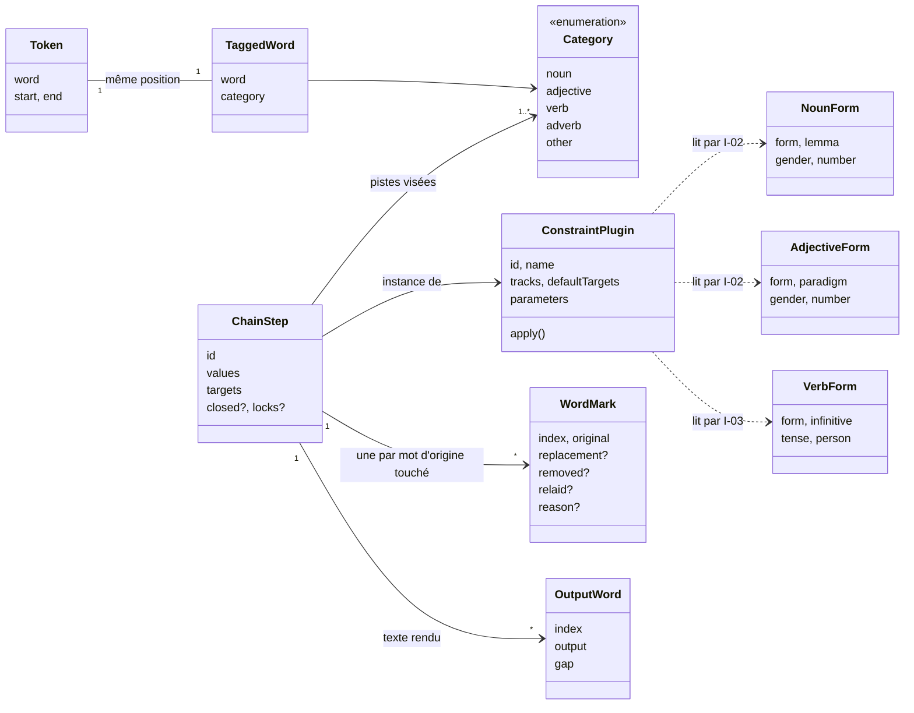

# 8. Concepts transversaux

**Niveau de détail :** ESSENTIAL. On y trouve aussi le modèle du domaine, la stratégie de test et
l'accessibilité, parce que chacun traverse plusieurs briques.

## Vue d'ensemble

Trois idées traversent tout Oulipao :
- **Le mot d'origine est l'unité de compte, de bout en bout.** L'étiqueteur rend un mot étiqueté
  par mot du découpage. Chaque contrainte rend une marque par mot d'origine. L'Interface affiche
  une case de la grille par mot d'origine.
- **Toute donnée qui entre est validée par un schéma zod**, qu'elle vienne d'un dictionnaire, d'un
  étiqueteur ou d'un geste.
- **Chaque mot laissé tel quel dit pourquoi.** Une contrainte est une règle énoncée, donc son effet
  doit pouvoir s'expliquer, mot à mot.

Ces trois idées concernent le Domaine, les Adaptateurs et l'Interface, et pour certaines aussi les
Outils.

Plusieurs sujets classiques n'ont pas de contenu ici, parce que le système n'en a pas :
l'authentification, les droits d'accès, la persistance, la messagerie, la journalisation côté
serveur. Les sous-sections concernées le disent en une ligne, plutôt que de rester vides.

---

## 8.1 Modèle du domaine

### Entités principales

| Entité | Ce qu'elle représente | Où elle sert (section 5) |
|--------|-----------------------|--------------------------|
| `Token` | Un mot du découpage du texte (`tokenize`) : des lettres, avec élisions et clitiques | Domaine, Adaptateurs (les étiqueteurs s'alignent dessus) |
| `TaggedWord`, `Category` | Un mot et sa piste, parmi cinq. Les valeurs sont en anglais (`noun`…), les libellés affichés en français. | Domaine, Adaptateurs (sortie de `Tagger`), Interface (pistes), Outils (mesure) |
| `NounForm`, `AdjectiveForm`, `VerbForm` | Une forme du dictionnaire, avec son lemme et ses traits (genre, nombre ; temps, personne) | Adaptateurs (lus et validés dans les TSV), Domaine (choix et accord) |
| `ConstraintPlugin` | Un type de contrainte : ses réglages déclarés, les pistes qu'il sait traiter, son application. Il y en a cinq : S+n, lipogramme, tri par piste, bord, mise en vers (`installedPlugins`). | Domaine (définition), Interface (registre, rack, recettes) |
| `ChainStep` | Une instance placée dans la chaîne : ses réglages, ses pistes visées, et sa portée par mot : les pas bouchés (`closed`) et les verrous (`locks`) | Domaine (`runChain`), Interface (état de la table) |
| `WordMark` | Ce qu'une instance a fait d'un mot d'origine : remplacé, retiré, recoupé à la ligne, ou laissé avec sa raison | Domaine (produit), Interface (inspecteur, mise en évidence) |
| `OutputWord` | Le texte rendu, mot d'origine par mot d'origine, avec le blanc qui le précède | Domaine (relu par l'instance suivante), Interface (texte résultant) |

Les « recettes » (`src/ui/tracks/recipes.ts`) sont des contraintes de l'Oulipo nommées, qui se
réduisent à une ou plusieurs instances des types installés. Ce sont des objets de l'Interface, pas
du Domaine.

---

## 8.2 Sécurité et confidentialité

- **Authentification, droits d'accès :** aucun. Il n'y a ni compte, ni rôle, ni point d'entrée qui
  accepte des données (sections 2.2 et 7).
- **Le texte du lecteur :** il n'existe qu'en mémoire, dans l'onglet, et n'est écrit nulle part :
  ni stockage du navigateur, ni requête. C'est l'objectif 1 de la section 1.2. La règle s'impose à
  toute brique de l'exécution : un adaptateur ne reçoit jamais le texte pour l'envoyer, il ne fait
  que rapporter des fichiers (I-04) ou faire tourner le modèle sur place (I-01).
- **En transit :** HTTPS partout. TLS est terminé par GitHub Pages, jsDelivr et Hugging Face, et
  `http://` est redirigé en 301 (section 7).
- **Secrets :** aucun, ni côté client, ni dans la CI, hormis le jeton que GitHub Actions fournit
  pour publier sur Pages.
- **Politique de sécurité du contenu :** les deux pages déclarent une CSP. `connect-src` n'admet que le site, `cdn.jsdelivr.net`, `huggingface.co` et `*.hf.co` ;
  les scripts ne viennent que du site, de jsDelivr et de copies `blob:` (le moteur ONNX en
  fait une de son module). L'objectif 1 tient donc même si un code tiers est altéré, pour tout
  hôte hors des trois fournisseurs (QS-02).
- **Ce qui manque :** il n'y a pas de SRI sur le code chargé de jsDelivr (RISK-02). Un module
  altéré pourrait encore viser l'un des hôtes autorisés. L'adresse IP du visiteur part chez GitHub Pages
  à l'ouverture, et chez jsDelivr et Hugging Face seulement au premier clic, après une notice
  (section 2.5).

---

## 8.3 Données et persistance

- **Persistance :** aucune. Rien n'est sauvegardé (ADR-001, RISK-04).
- **Données de référence, en lecture seule :** les trois fichiers TSV dérivés de Grammalecte. Le
  même cycle traverse quatre briques :
  - les **Outils** les écrivent (`npm run build:*`) ;
  - les **Données dérivées** les servent telles quelles ;
  - les **Adaptateurs** les lisent par `TextSource` (I-04), avec `fetch` ou `node:fs`, puis
    valident chaque ligne et lèvent une erreur au premier écart ;
  - le **Domaine** les consulte par `MorphologyRepository` et `VerbRepository`, sous forme
    d'objets immuables une fois construits (ADR-006).
- **Version :** l'adresse porte une version (`?v=…`), changée à la main à chaque régénération
  (RISK-07).

---

## 8.4 Gestion des erreurs

- **Validation à la frontière :** tout ce qui entre passe par un schéma zod.
  - Une ligne de dictionnaire non conforme fait échouer le chargement, avec la ligne fautive.
  - Une sortie d'étiqueteur non conforme, ou décalée d'un mot, fait échouer `tagText`, qui nomme
    l'étiqueteur et le mot fautif.
  - Un geste non conforme sur la table est refusé par `reduce`.

  Le Domaine ne corrige jamais une donnée douteuse : il la refuse.
- **Propagation :** des exceptions, attrapées à un seul endroit, le contrôleur de l'Interface. Il
  les transforme en état affiché : modèle en erreur, échec de l'étiquetage, échec du chargement
  des verbes, copie impossible.
- **Ce que voit le lecteur :** un message en français qui nomme ce qui a échoué, et, quand c'est
  possible, « Vous pouvez relancer » avec un bouton, dans une zone `role="alert"`. Aucun détail
  technique n'est masqué : le message d'origine est repris, faute de journal où l'envoyer.
- **Relance :** toujours manuelle. Les chargeurs du modèle, de la morphologie et des verbes
  oublient une promesse ratée, donc relancer repart de zéro (section 6.4). Il n'y a ni nouvelle
  tentative automatique, ni coupe-circuit, ni repli.
- **Un mot qu'une contrainte ne sait pas traiter n'est pas une erreur.** Il est laissé tel quel,
  avec sa raison (8.6).

---

## 8.5 Observabilité

Il n'y a aucune observabilité en production, par choix : ni journal envoyé, ni métrique, ni
traceur, ni mesure d'audience (sections 2.3 et 7). C'est le prix de l'objectif 1. On ne saura donc
pas si le site échoue chez quelqu'un d'autre que le fondateur.

La qualité se mesure hors ligne, par les Outils :
- `npm run measure` donne la justesse de chaque étiqueteur sur les textes de référence ;
- `npm run transform:references` produit les grilles de relecture du S+7 (`resultats/`) ;
- `npm run check:palette` vérifie les contrastes.

Côté publication, le seul signal est le statut du workflow GitHub Actions.

---

## 8.6 Explicabilité : chaque mot laissé dit pourquoi

Ce concept est propre à Oulipao, et il découle du principe « une contrainte est une règle
énoncée » (section 2.2).

- Chaque contrainte rend, pour chaque mot de ses pistes, un `WordMark` : remplacé, retiré,
  recoupé à la ligne, ou laissé avec une `reason` en français. Par exemple : « conjugaisons en
  cours de chargement », « auxiliaire », un pas bouché, ou aucun voisin sans la lettre.
- La chaîne garde, pour chaque mot rendu, le mot d'origine dont il vient (`origin`), même quand
  une instance relit la sortie de la précédente comme un texte neuf.
- L'Interface en tire l'inspecteur (une bande par instance), la mise en évidence des mots changés,
  le résumé des mots laissés et la mention de la chaîne jointe au texte copié.
- Les Outils en tirent les grilles de relecture.

Toute contrainte nouvelle doit rendre ces marques. C'est une partie du contrat de plugin (I-05),
pas un ajout de l'interface.

---

## 8.7 Communication entre briques

Il n'existe aucune API réseau entre briques : tout se fait par appels en mémoire, dans un seul
fichier assemblé. Les seules frontières qui méritent une convention sont les ports (I-01 à I-04),
dont les données sont validées à l'entrée, et le contrat de plugin (I-05). Ce contrat est interne,
non versionné, et peut changer librement (ADR-004). Les échanges réseau, uniquement des
téléchargements de fichiers statiques, sont décrits dans la section 3.2.

---

## 8.8 Stratégie de test

| Type | Portée | Outils | Exigence | Où |
|------|--------|--------|----------|----|
| Unitaire, domaine | Découpage, étiquetage, chaque contrainte, accords, chaîne | `node --test` directement sur les `.ts` ; dictionnaire factice en mémoire (`test/support/morphology.ts`) | Couverture d'au moins 90 % en lignes, branches et fonctions, sur tout `src/` | `test/domain/` |
| Adaptateurs | Lecture et validation des TSV, sources de texte, correspondance des étiquettes | `node --test`, petits fichiers en mémoire | Même seuil | `test/adapters/` |
| Interface | Contrôleur, modèle de vue, état de la table, composants | `node --test` ; composants rendus en texte par `preact-render-to-string` | Même seuil | `test/ui/` |
| Justesse linguistique | Étiqueteurs et S+7 sur trois textes de référence de 200 mots annotés à la main | `npm run measure`, `npm run transform:references`, relecture à la main | ≥ 9 sur 10 (objectif 2) | Manuel : ne tourne **pas** dans `npm test` ni en CI |
| Palette | Contrastes WCAG et distinction en daltonisme | `npm run check:palette` | ≥ 4,5:1 et ΔE ≥ 20 | Manuel : pas en CI |

Deux fichiers sont exclus de la couverture, et nommés dans `package.json` : le chargement du
modèle CamemBERT et le montage des pages sur le DOM. Leur logique est extraite dans des fonctions
pures, qui sont testées. La CI lance `typecheck` et `test`, et ne publie rien si l'un des deux échoue.

---

## 8.9 Accessibilité

Ce concept concerne l'Interface, le Domaine (`palette.ts`) et les Outils (`check:palette`), et il
réalise l'objectif 5 de la section 1.2.

- **Couleurs :** des jetons fixés par `DESIGN.md`. Chaque piste a sa couleur, et elle est toujours
  doublée d'un second signe : soulignement, motif, libellé. La couleur seule ne porte jamais
  l'information. Le calcul des contrastes et de la distinction en daltonisme est une fonction pure
  du Domaine, appelée par un script.
- **Clavier :** chaque geste de la table a son équivalent au clavier. Les flèches et Échap
  servent dans l'inspecteur, ↑ et ↓ réordonnent la chaîne, et les raccourcis sont ignorés quand le
  focus est dans un champ de saisie.
- **Lecteurs d'écran :** chaque case de la grille porte un nom accessible qui donne la piste, le
  mot, l'état et ses verrous. Les erreurs s'annoncent dans une zone `role="alert"`.
- **Petits écrans :** la page ne défile jamais à l'horizontale. La partition revient à la ligne,
  comme une partition de musique.
- **Ce qui n'est pas garanti :** l'usage au clavier et l'affichage à 375 px ne sont gardés par
  aucun test automatique (RISK-09).
